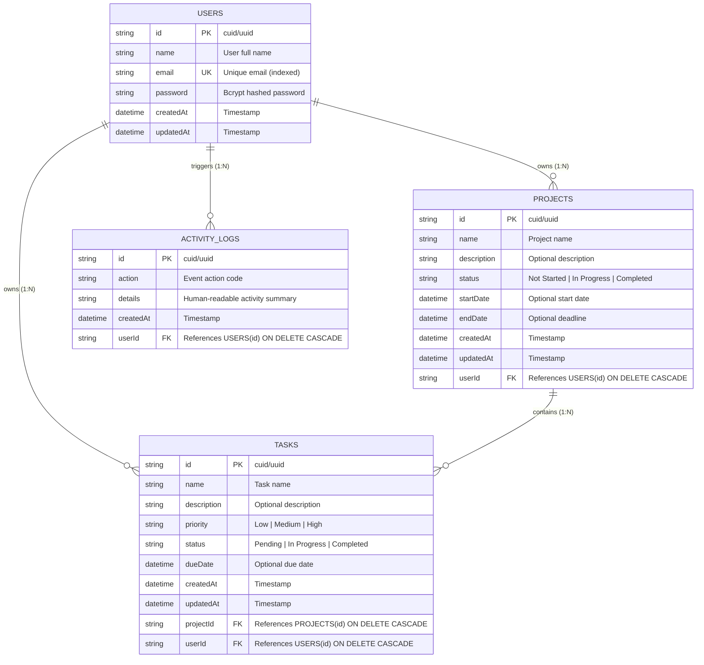

# Database Schema & Entity-Relationship (ER) Diagram

This document details the relational database design for the **FocusProject** System.

---

## 1. Mermaid Entity-Relationship (ER) Diagram

---

## 2. Table Structures & Constraints

### `users`
| Column | Type | Constraints | Description |
|---|---|---|---|
| `id` | `VARCHAR(36)` | `PRIMARY KEY`, Default CUID | Unique User Identifier |
| `name` | `VARCHAR(100)` | `NOT NULL` | Full Name of the User |
| `email` | `VARCHAR(150)` | `NOT NULL, UNIQUE` | Unique email for authentication |
| `password` | `VARCHAR(255)` | `NOT NULL` | Bcrypt hashed password (10 rounds) |
| `createdAt` | `DATETIME` | `NOT NULL`, Default `NOW()` | Account creation timestamp |
| `updatedAt` | `DATETIME` | `NOT NULL` | Last update timestamp |

### `projects`
| Column | Type | Constraints | Description |
|---|---|---|---|
| `id` | `VARCHAR(36)` | `PRIMARY KEY`, Default CUID | Unique Project Identifier |
| `name` | `VARCHAR(150)` | `NOT NULL` | Project Title |
| `description` | `TEXT` | `NULLABLE` | Detailed project scope |
| `status` | `VARCHAR(50)` | `NOT NULL`, Default `'Not Started'` | Enum: `'Not Started'`, `'In Progress'`, `'Completed'` |
| `startDate` | `DATETIME` | `NULLABLE` | Kickoff date |
| `endDate` | `DATETIME` | `NULLABLE` | Completion deadline |
| `userId` | `VARCHAR(36)` | `NOT NULL`, `FOREIGN KEY` -> `users(id)` | Project Owner (Cascades on delete) |
| `createdAt` | `DATETIME` | `NOT NULL`, Default `NOW()` | Creation timestamp |
| `updatedAt` | `DATETIME` | `NOT NULL` | Last update timestamp |

### `tasks`
| Column | Type | Constraints | Description |
|---|---|---|---|
| `id` | `VARCHAR(36)` | `PRIMARY KEY`, Default CUID | Unique Task Identifier |
| `name` | `VARCHAR(150)` | `NOT NULL` | Task title |
| `description` | `TEXT` | `NULLABLE` | Task details / notes |
| `priority` | `VARCHAR(20)` | `NOT NULL`, Default `'Medium'` | Enum: `'Low'`, `'Medium'`, `'High'` |
| `status` | `VARCHAR(50)` | `NOT NULL`, Default `'Pending'` | Enum: `'Pending'`, `'In Progress'`, `'Completed'` |
| `dueDate` | `DATETIME` | `NULLABLE` | Due date deadline |
| `projectId` | `VARCHAR(36)` | `NOT NULL`, `FOREIGN KEY` -> `projects(id)` | Parent Project (Cascades on delete) |
| `userId` | `VARCHAR(36)` | `NOT NULL`, `FOREIGN KEY` -> `users(id)` | Task Owner (Cascades on delete) |
| `createdAt` | `DATETIME` | `NOT NULL`, Default `NOW()` | Creation timestamp |
| `updatedAt` | `DATETIME` | `NOT NULL` | Last update timestamp |

### `activity_logs`
| Column | Type | Constraints | Description |
|---|---|---|---|
| `id` | `VARCHAR(36)` | `PRIMARY KEY`, Default CUID | Unique Log Entry ID |
| `action` | `VARCHAR(100)` | `NOT NULL` | E.g., `'TASK_COMPLETED'`, `'PROJECT_CREATED'` |
| `details` | `TEXT` | `NOT NULL` | Description of action |
| `userId` | `VARCHAR(36)` | `NOT NULL`, `FOREIGN KEY` -> `users(id)` | Actor User |
| `createdAt` | `DATETIME` | `NOT NULL`, Default `NOW()` | Timestamp of event |

---

## 3. Relational Integrity & Data Isolation

1. **Foreign Key Cascades:** Deleting a project automatically deletes all child tasks safely (`onDelete: Cascade`).
2. **Account Isolation:** Every Project and Task is directly keyed by `userId`. All backend queries enforce `where: { userId: req.user.id }` ensuring zero cross-tenant access.
3. **ORM Parameterization:** Prisma ORM automatically prepares and parameterizes all SQL queries, providing complete protection against SQL injection attacks.
